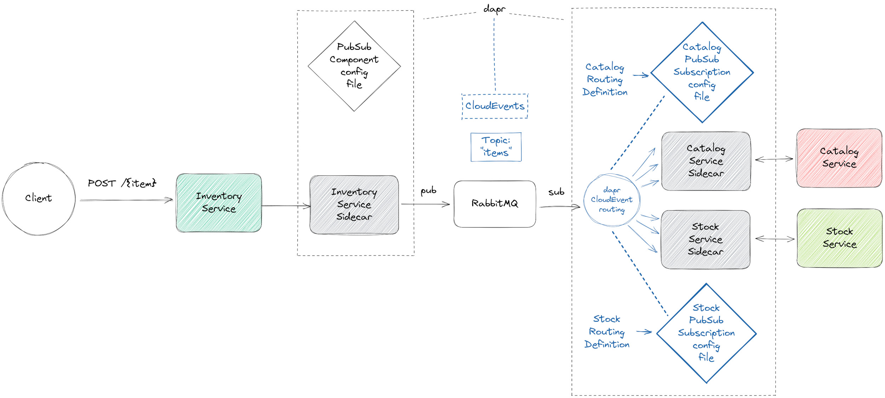

# dapr example - publish-subscribe message routing

<a href="https://www.dapr.io/"></a>

The following scenario is implemented here.



A client posts a new item to the inventory service.
Thereupon, the inventory service creates and publishes an item data record
wrapped in a _custom CloudEvent_ to the "_items_" topic.
The other two services, catalog and stock are subscribers of that topic.

_dapr_ routes the CloudEvents to different endpoints, 
depending on attribute values of the CloudEvents as defined in the
subscription config files under `components/local`.


## Custom CloudEvents

In general, any message, sent from a service to a topic using _dapr_,
is automatically wrapped in a [CloudEvents envelope](https://docs.dapr.io/developing-applications/building-blocks/pubsub/pubsub-cloudevents/).
As mentioned above, we use a _custom_ CloudEvent of type "item" in this scenario.
To do so, we set the
[Content-Type Header](https://docs.dapr.io/reference/api/pubsub_api/#headers)
to `application/cloudevents+json` when calling the _dapr_ publish API while passing our CloudEvent.
In addition, our CloudEvent must of course implement at least the 
mandatory fields specified in the [CloudEvents specification](https://github.com/cloudevents/spec).


## Prerequisites

- [dapr CLI](https://docs.dapr.io/getting-started/install-dapr-cli/)
- Java (Version >=17)
- A running [RabbitMQ](https://www.rabbitmq.com/) instance
  ```shell
  docker run --rm -it -p 15672:15672 -p 5672:5672 rabbitmq:3
  ```


## Get started


### 1. Build all services

```shell
./gradlew buildAllServices
```


### 2. Run each service alongside a dapr sidecar

```shell
dapr run --app-id inventory-service --app-port 8080 --dapr-http-port 3500 --components-path components/local -- java -cp inventory/build/libs/fat.jar org.example.InventoryKt
```
```shell
dapr run --app-id stock-service --app-port 8081 --dapr-http-port 3501 --components-path components/local -- java -cp stock/build/libs/fat.jar org.example.StockKt
```
```shell
dapr run --app-id catalog-service --app-port 8082 --dapr-http-port 3502 --components-path components/local -- java -cp catalog/build/libs/fat.jar org.example.CatalogKt
```

As you can see, the dapr CLI is used to start up both, the dapr sidecar and the service.


### 3. Be the client - post an item
```shell
curl -X POST localhost:8080/pen
```
```shell
curl -X POST localhost:8080/book
```
```shell
curl -X POST localhost:8080/spoon
```
```shell
curl -X POST localhost:8080/fork
```
```shell
curl -X POST localhost:8080/cup
```
```shell
curl -X POST localhost:8080/somethingelse
```

# References
- [dapr concepts](https://docs.dapr.io/concepts/)
- [dapr publish and subscribe](https://docs.dapr.io/developing-applications/building-blocks/pubsub/)
- [dapr routing](https://docs.dapr.io/developing-applications/building-blocks/pubsub/howto-route-messages/)
- [dapr CloudEvents](https://docs.dapr.io/developing-applications/building-blocks/pubsub/pubsub-cloudevents/)
- [CloudEvents](https://cloudevents.io/)

**Similar projects of mine**
- [dapr pub/sub](https://github.com/BarbieCue/dapr-pub-sub)
- [dapr distributed tracing pub/sub](https://github.com/BarbieCue/dapr-distributed-tracing-pub-sub)
